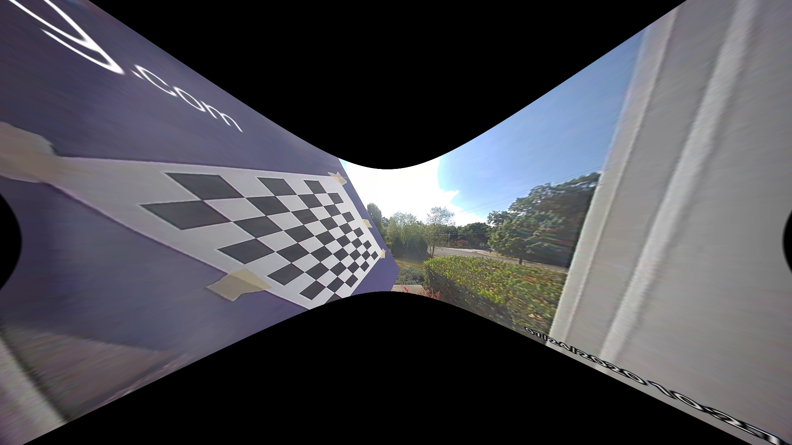

# defisheye
Python scripts for unwarping the images produced by a fisheye lens.

Code is adapted from Kenneth Jiang from [this Medium article](https://medium.com/@kennethjiang/calibrate-fisheye-lens-using-opencv-333b05afa0b0), 
which can be referenced for a more in-depth explanation.

## Example
### Input


### Output


## Setup
### Install pip packages
```
python3 -m venv env; source env/bin/activate
pip install -r requirements.txt
```

### Calibrate to your specific fisheye lens
Every lens is different so we must calibrate our program to our lens. 

To obtain the proper calibration settings for our lens, we must:
* Print [this checkerboard image](https://github.com/kvntng17/defisheye/blob/master/calibration_pattern.png) on regular sized printer paper.
* Stick the checkerboard image we just printed onto a *flat* surface. A clipboard, or in my case, a shoebox works fine. The key here is the checkerboard *must be flat.*
* Capture photos of the printed checkerboard from multiple angles using our fisheye lens. We should take photos from as many angles as possible. 30+ photos from different angles will suffice.
* ```mkdir photos``` and move the images taken in the previous step into the ```photos``` directory. These should be png or jpg format.

Then to obtain our calibration settings (saved to ```calibrate_config.py```):
```
python calibrate.py
```

### Remove fisheye distortion
```
# Remove fisheye and resize image to fit original image size (black around edge is cropped)
python defisheye.py input.jpg

# Remove fisheye and keep entire image
python defisheye_retain_all.py input.jpg
```
The ```balance``` value [0, 1.0] used in ```defisheye_retain_all.py``` can be modified to crop more or less of the black around the edge of the undistorted image. 
For example ```balance=0.0``` will produce cropped output with no black edges while ```balance=1.0``` will produce uncropped output.
By default, ```balance``` is set to 1.0.
